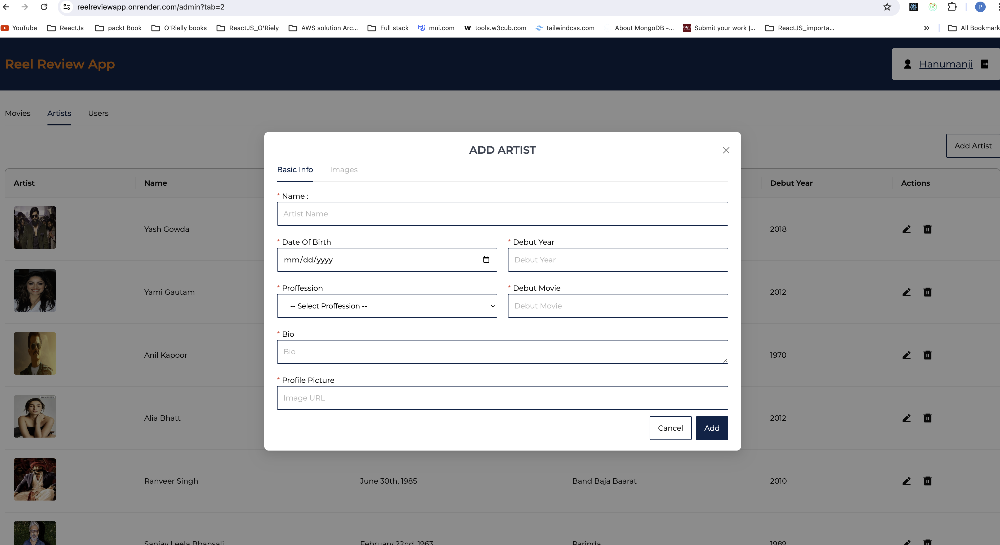
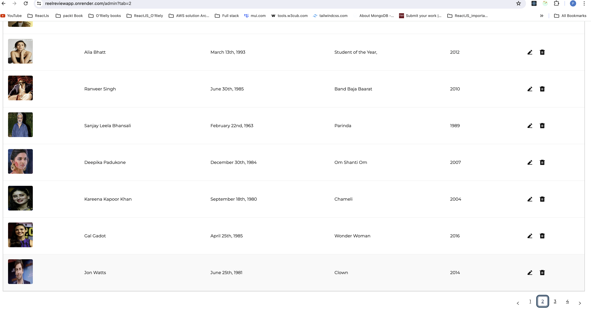
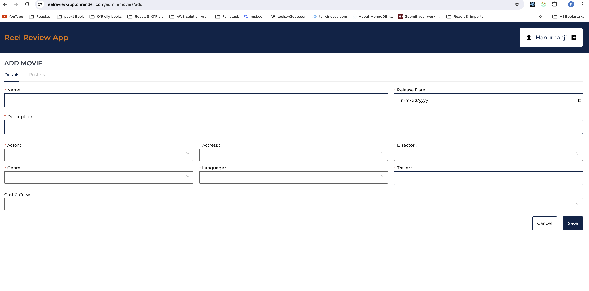
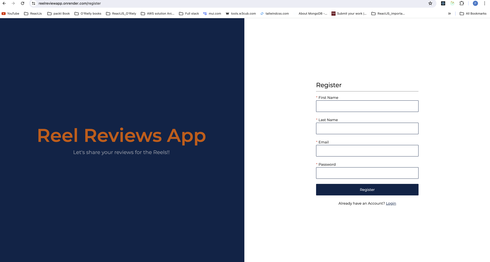

# FullStack_Apps
<a href = "https://reelreviewapp.onrender.com"> ReelReviewsFullStackApp-Demo</a>
# Feature of the Reel Review App

- Movies

  - All the movies on Home Page
  - Click on single Movie to see the movie Details
  - Rating and comment for the movies
  - Navigate to Artist page throgh movie cast lists
  
  
  
  

- Artist

  - Create Artist
  - Update Artist
  - Delete Artist
  - Upload Profile image
  - Upload multiple Images and delete
    
    
    

- Reviews

  - Create Reviews
  - Update Reviews
  - Delete Reviews
  - Calculate average rating based on all the provided stars
  
  
  

- User

  - Non Admin user can see the reviews and raring in tabular format
  - Update or delete the reviews from Users Page
  - Admin access can see all the reviews
  - User can change Account details
  - Password change
    
    
    
    
    

- Account

  - Register User
  - Login User
  - JWT Authentication using token
    
    

- Image Uploads
  - Upload Images and posters through cloudinary into App
  - Upload , retreive and delete image from the MongoDB database

- Filters the Movie
  - Filter based on Movies from Search bar
  - Filter by Language
  - Filter by Gnere
